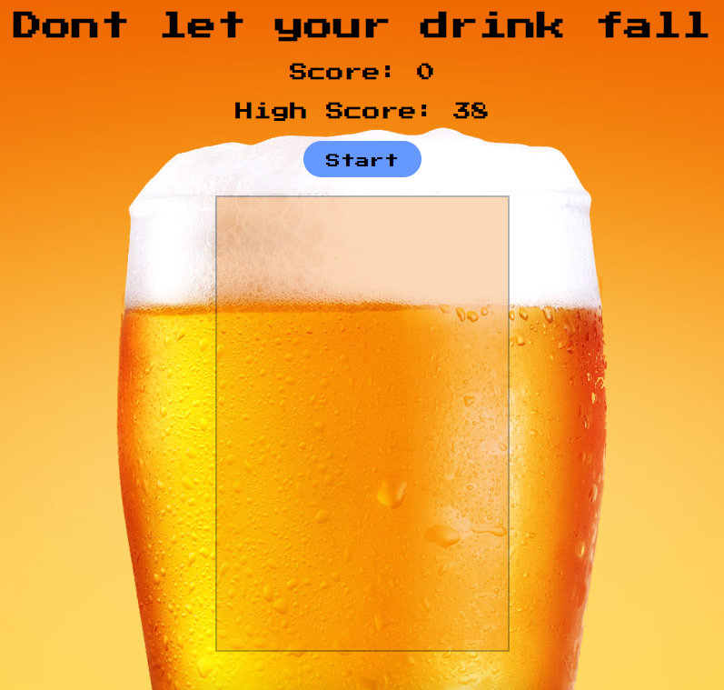
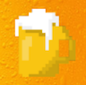
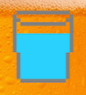
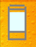
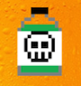

# WDI-Project-1

## Introduction
***Don't let your drink fall*** is a one player speed and precision based game. The game was created as my first project at **General Assembly** using Javascript, HTML, and CSS. An online version of my game can be found [here](https://rocky-wave-47242.herokuapp.com "Don't let your drink fall").The code can be viewed [here] (https://github.com/BRHGreen/wdi-project-1).
## How to play
Playing this game is quite simple. The goal of the game is to rack up as many points as possible in a single attempt. To start the game the player must lick the start button. One the game has started different objects will fall from the top of the outlined box in the middle of the screen. The player must click these objects in order before they hit the bottom of the outlined box. There are two types of falling objects. 
**The possible positive objects are:**

  

The first image represents a beer and is the most common of all the objects. By clicking on the beer you gain one point and the game speeds up slightly.

The second image represents a glass of water. This is one of the two most rare objects. By clicking on the water you slow the game speed down and are awarded 1 point.

The third image represents a shot of vodka. This is the other most rare object in the game. By clicking on the shot of vodka the game still speeds up. However, you receive 5 points instead of the usual 1.

**There is also one negative object in the game:**

The image above represents a bottle of poison. This is the second most common object. This is a negative object because by clicking on it the round is automatically ended. This object is to be avoided and the game will not end if it hits the bottom of the outlined box.

##Project Brief

1. Create a game using the knowledge gained over the last 2 weeks.
2. The game should utilise **Javascript**, **HTML**, and **CSS**
3. The code for the game should be refactored and object orientated.

##How it was made
***Don't let your drink fall*** was built using **Javascript**, **HTML**, and **CSS**. It also used:

- [jQuery library] (https://code.jquery.com/jquery-3.2.1.js)
- [Fonts] (https://fonts.google.com/)

##Credits

- The background image was found [here] (http://www.newenglandbrewerytours.com/)
- The image for the beer was found [here] (https://www.spreadshirt.co.uk)
- I recieved help from GA instructors Alex Chin, and Rane Gowan, GA Teachers Assistants Ed Compton, and Natalie Huitson, and the rest of the GA WDI26 class.
